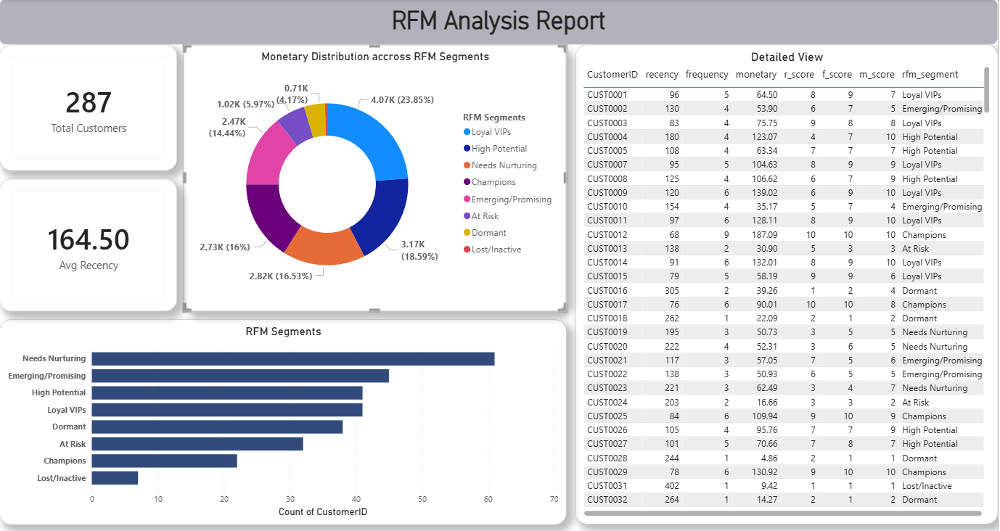

# Customer RFM Segmentation — End-to-End Data Analytics Project


---

## Overview

An end-to-end data analytics project that transforms 12 months of raw sales transaction data into meaningful customer segments using the **RFM (Recency, Frequency, Monetary)** framework.

The pipeline covers the full data lifecycle — ingesting and cleaning raw CSV files in **Google BigQuery** (cloud data warehouse), building a tiered RFM scoring model in **SQL**, and delivering insights through an interactive **Power BI dashboard**.

---

## Business Problem

> *"Which customers are our most valuable — and which ones are slipping away?"*

RFM analysis answers this by scoring every customer on three dimensions:
- **Recency** — How recently did they buy?
- **Frequency** — How often do they buy?
- **Monetary** — How much do they spend?

This gives the business a clear, data-driven way to prioritize marketing efforts, reward loyal customers, and re-engage those at risk of churning.

---

## Repository Structure

```
customer-rfm-analytics/
│
├── README.md                      ← Project documentation
├── rfm_dashboard.pbix             ← Power BI report file
├── rfm_dashboard_ss.png           ← Dashboard screenshot
│
├── sql/
│   └── rfm_segmentation.sql      ← Full SQL pipeline (cleaning → RFM → segments)
│
└── data/
    └── data_note.md              ← Data source description (raw files not included)
```

---

## Tech Stack

| Layer | Tool | Purpose |
|---|---|---|
| Cloud Data Warehouse | Google BigQuery | Store, clean, and query data at scale |
| Language | SQL (Standard SQL) | Data cleaning, RFM logic, segmentation |
| Visualization | Microsoft Power BI Desktop | Interactive dashboard for business insights |
| Data Source | 12 monthly CSV files (2025) | Raw sales transaction records |

---

## How It Works

### 1. Data Ingestion and Cleaning
- Uploaded 12 monthly sales CSV files into Google BigQuery as separate tables
- Resolved a real-world schema mismatch — the December file had extra null columns compared to the rest
- Fixed using `SELECT * EXCEPT` to normalize the schema, then combined all months into one unified dataset using `UNION ALL`

### 2. RFM Metric Calculation
Three core metrics are computed per customer from transaction history:

| Metric | Definition |
|---|---|
| Recency (R) | Days since the customer's last purchase |
| Frequency (F) | Total number of transactions made |
| Monetary (M) | Total revenue generated by the customer |

### 3. Scoring with NTILE
Each metric is independently scored on a **1–10 scale** using BigQuery's `NTILE(10)` window function, giving a maximum **Total RFM Score of 30**.

```sql
-- Recency: lower days = more recent = higher score
NTILE(10) OVER (ORDER BY recency_days ASC) AS r_score,

-- Frequency: more transactions = higher score
NTILE(10) OVER (ORDER BY frequency DESC) AS f_score,

-- Monetary: higher spend = higher score
NTILE(10) OVER (ORDER BY monetary DESC) AS m_score
```

### 4. Customer Segmentation
A `CASE` statement maps total RFM scores into 8 business-ready segments:

| Segment | Score Range | What It Means |
|---|---|---|
| Champions | 28–30 | Bought recently, buy often, highest spenders |
| Loyalists | 24–27 | Consistent buyers with strong value |
| High Potential | 20–23 | Recent buyers growing in value |
| Emerging | 16–19 | Newer customers showing promise |
| Needs Nurturing | 12–15 | Below-average engagement across all metrics |
| At Risk | 8–11 | Previously active, now declining |
| Dormant | 4–7 | Low activity across all metrics |
| Inactive | Below 4 | No meaningful recent activity |

---

## Dashboard

The Power BI report includes:

- **KPI Card** — Total unique customers at a glance
- **Horizontal Bar Chart** — Customer count per segment, sorted by value
- **Total Revenue Measure** — Custom DAX measure using `SUM(monetary)`
- **Detailed Table** — Individual customer IDs with their R, F, and M scores for drill-down analysis



---

## Key Challenges Solved

**Schema mismatch across monthly files** — The December CSV had extra null columns that broke the `UNION ALL`. Fixed by using `SELECT * EXCEPT(col)` to drop the unwanted column before combining, which is a common real-world data engineering problem.

**Scoring direction for Recency** — Unlike Frequency and Monetary where higher = better, Recency required an inverted sort. A customer who bought 2 days ago should score a 10, not a 1. This was handled by sorting `recency_days ASC` inside `NTILE`.

**Meaningful segment boundaries** — The 8-tier `CASE` boundaries were designed to produce business-meaningful groups rather than arbitrary equal splits, making the output directly usable by marketing and sales teams.

---

## How to Reproduce

### Prerequisites
- Google Cloud account with BigQuery access (free tier works)
- Power BI Desktop (free from Microsoft)

### Steps

1. Clone this repository
```bash
git clone https://github.com/akardhansharma/customer-rfm-analytics.git
```

2. Load your monthly CSV files into BigQuery as separate tables

3. Open `sql/rfm_segmentation.sql` in the BigQuery console, update the dataset/table references to match your project, and run the full script

4. Open `rfm_dashboard.pbix` in Power BI Desktop, go to **Transform Data → Data Source Settings**, and update the BigQuery connection to point to your dataset

---

## Data Note

Raw CSV files are not included in this repository. The dataset consists of 12 monthly sales transaction files for 2025. See `data/data_note.md` for the full schema description.

---

## Author

**Akardhansharma**  
Data Analyst Student  
[GitHub](https://github.com/akardhansharma)

---

## License

This project is open source and available under the [MIT License](LICENSE).
